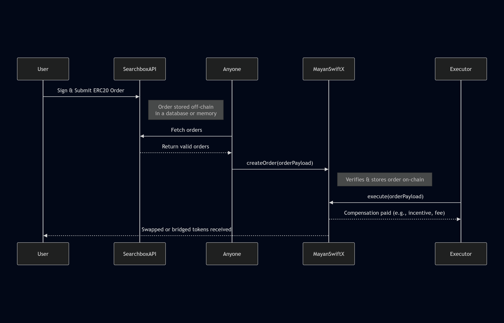

# Mayan-swiftX

Mayan-swiftX is a gasless custom swap order implementation built on top of the Mayan Swift protocol. This extension enables the following functionalities:

1. **Limit Orders**: Execute orders based on specified price targets.
2. **Conditional Orders**: Execute orders based on predefined conditions.
3. **Recurring Cross-Chain Swaps**: Facilitate automated swaps across different blockchains at regular intervals.

With Mayan-swiftX, users can enhance their trading strategies by leveraging these advanced order types, providing greater flexibility and control over their transactions.

## How It Works (Users)



1. A user signs a custom ERC20 order and sends it to the Searchbox API.
2. Anyone can call this API to retrieve the order or orders, validate them, and create them on Mayan Swift.
3. The executor is compensated, and the user receives the requested tokens.

⚠️ Note: The POST endpoint for submitting signed ERC20 orders is intentionally not publicly exposed at this stage. While the backend API supports signed order intake, it is currently used internally to prevent abuse.
Signed messages are costless to produce and can be easily spammed at scale. All other endpoints remain publicly accessible.
To use the system, build an order with the API off-chain and execute it directly against the smart contract.

## How It Works (Developers)

1. A developer integrates the Searchbox API, takes the user's input parameters, and may specify one or more executors. They then build an order and call the `createAndPublish` function.
2. It is the responsibility of the specified executor to execute the order on Mayan Swift.

## Project Structure

The project is organized into the following main directories:

### Root Directory Structure
```
mayan-swiftX/
├── packages/
│   ├── api/            # API implementation and endpoints
│   └── contracts/      # Smart contracts and related utilities
└── node_modules/       # Project dependencies
```

### Key Directories
* **packages/api**: Contains all API endpoints and backend logic
  - API routes for order management
  - Implementation of gasless swap functionality
  - Integration with Mayan Swift protocol

* **packages/contracts**: Contains smart contract related code
  - Smart contract implementations
  - Contract interfaces
  - Contract utilities and helpers

## API Documentation

### 1. Get Conditional Order
Retrieve a conditional order based on specified parameters.

#### Example:
[https://github.com/searchboxai/mayan-swiftX/blob/main/packages/api/src/example/conditionalOrders.ts]

### 2. Get Gasless Conditional Tokens
Retrieve tokens eligible for gasless conditional orders on a specific chain.

#### Example:
```bash
curl https://mayan-swift-x.vercel.app/api/getGaslessCondTokens?chain=base
```

### 3. Get Gasless Limit Tokens
Retrieve tokens eligible for gasless limit orders on a specific chain.

#### Example:
```bash
curl https://mayan-swift-x.vercel.app/api/getGaslessLimitTokens?chain=base
```

### 4. Get Gasless Timed Tokens
Retrieve tokens eligible for gasless timed orders on a specific chain.

#### Example:
```bash
curl https://mayan-swift-x.vercel.app/api/getGaslessTimedTokens?chain=base
```

### 5. Get Instant Order
Retrieve an instant order based on parameters such as amount, tokens, chains, and destination address.

#### Example:
[https://github.com/searchboxai/mayan-swiftX/blob/main/packages/api/src/example/conditionalOrders.ts]

### 6. Get Integrated Chains
Retrieve a list of chains integrated with the system.

#### Example:
```bash
curl https://mayan-swift-x.vercel.app/api/getIntegratedChains
```

### 7. Check If a Chain Is Integrated
Check if a specific chain is integrated with the system.

#### Example:
```bash
curl https://mayan-swift-x.vercel.app/api/isIntegratedChain?chain=base
```

